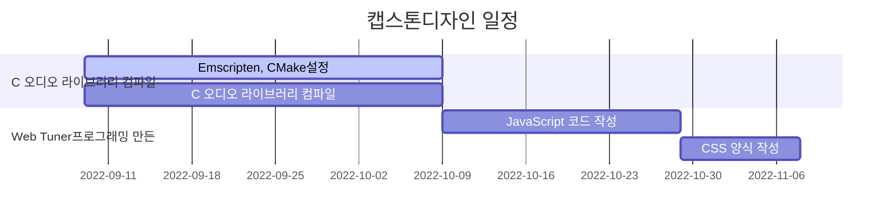
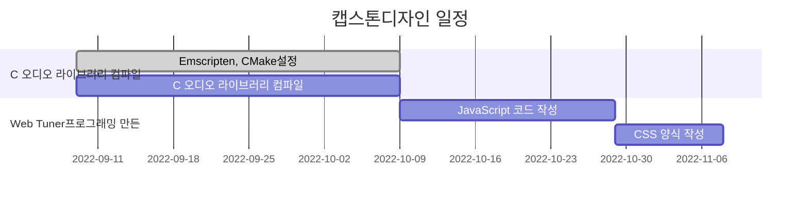
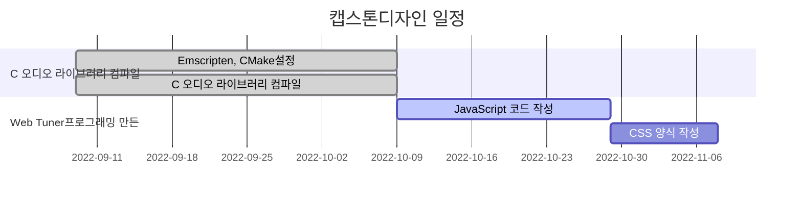

# aubiojs

| 프로젝트 주제 | WebAssembly 통해 Web Tuner프로그래밍 |
|:----:|:----:|
| 팀원 | 강영걸 |
| 작성일 | 2022.09.15 |

## install dependencies
```bash
$ npm install
```

## build .wasm file
```bash
$ npm build 
```

## start the dev server
```bash
$ npm run serve
```

## 프로젝트 배경

- 악기 연주를 할 때 항상 기준 조율을 해야 하는데 일반적으로 모두 네이티브 소프트웨어를 통해 이루어지는데 브라우저는 성능 문제로 인해 정확한 음고 검출을 할 수 없다

##  캡스톤디자인 목표

- WebAssembly 기반 브라우저 실시간 피치 감지

## 캡스톤디자인 관련 조사
- JavaScript는 동적 변수를 사용하는데 정적 변수 유형이 없기 때문에 JavaScript 실행 중에 변수 유형이 자주 바꿔서 엔진 최적화가 작동하지 않다. 이것은 JavaScript 실행 효율을 떨어뜨리는 주요 원인이다.
[](https://imgse.com/i/vx50bR)
- JavaScript 엔진이 asm.js를 실행한다는 것을 알게 되면 최적화된 코드임을 알 수 있으며 구문 분석 단계를 건너뛰고 어셈블리어로 바로 전환할 수 있다.또한 브라우저는 WebGL을 호출하여 GPU를 통해 asm.js를 실행한다. 즉, asm.js의 실행 엔진은 일반적인 JavaScript와 다르다.asm.js는 브라우저에서 네이티브 코드의 약 50%를 실행한다고 한다.
- WebAssembly는 최신 웹 브라우저에서 실행할 수 있는 새로운 유형의 코드입니다. 네이티브에 가까운 성능으로 동작하며 컴팩트한 바이너리 포맷을 제공하는 저수준 어셈블리 언어로, C/C++, Rust 등과 같은 언어의 컴파일 타겟으로써 그런 언어로 작성된 프로그램을 웹에서 사용할 수 있게 해준다. 또한 JavaScript와 함께 실행되며 서로를 보완할 수 있도록 설계되다.

## 캡스톤디자인 과정
- Emscripten 같은 도구를 사용해서 C언어로 작성된 오디오 라이브러리 aubio를 .wasm으로 컴파일하다.
- 생성된 aubio.wasm를 통해서 Web Tuner프로그래밍 만든다.

## 캡스톤디자인 일정



### 9.12 ~ 9.30 Emscripten 사용해서 C언어로 작성된 오디오 라이브러리 aubio를 .wasm으로 컴파일하다.
- aubio를 컴파일하기 위해서 [emscripten](https://emscripten.org/)를 설치해야 합니다.Emscripten은 WebAssembly 도구 체인의 중요한 구성 요소입니다.간단한 이해로 Emscripten은 C/C++ 코드를 ASM.js와 WebAssembly 코드로 컴파일하는 데 도움을 주며 필요한 자바스크립트 풀 코드를 생성하는 데 도움을 줍니다.
[](https://imgse.com/i/xmNYU1)
emscript 다중 파일 컴파일 떄 [CMake](https://cmake.org/) 필요합니다. CMake를 통해 여러 개의 c 파일을 동일한 대상 파일로 컴파일합니다. 음고검출과 박자검출만 필요하기 때문에 오디오 라이브러리 안에의 필요한 부분만 선택해서 컴파일하면 됩니다. javascript는 유형이 없는 언어이기 때문에 컴파일하기 전에 출력 함수의 데이터 형식을 지정해야 합니다.

- 박자검출결과
  [](https://imgse.com/i/xmBzqO)
  [](https://imgse.com/i/xmDolt)
  오디오 라이브러리의 박자검출함수를 사용하여 얻은 결과에는 일정한 오차가 있으며 테스트를 거친 오차는 1% 미만입니다.
  - [tempo](https://tourscholar.github.io/aubiojs/tempo.html)
  - [120BPM](https://www.youtube.com/watch?v=JwbMnagnFsc)
  
- 음고검출
  이 부분은 음고검출함수가 정상적으로 동작할 수 있는지를 확인하려고 합니다. 다음 단계는 음고검출함수를 위주로 프로그램을 개발할 계획입니다.
  - [pitch](https://tourscholar.github.io/aubiojs/pitch.html)

지금까지 성공적으로 오디오 라이브러리를 컴파일했습니다.그리고 음고검출함수와 박자검출함수의 실행가능성을 확인했습니다.


### 10.01 ~ 10.07 음고검출함수를 이용해서 주파수에 따라 대응하는 음표를 얻다
| 음명 | 주음 |  | 제2음 |  | 제3음 | 제4음 |  | 제5음 |  | 제6음 |  | 제7음 |
|:----:|:----:|------|------|------|------|------|------|------|------|------|------|------|
| 자연음 | C |  | D |  | E | F |  | G |  | A |  | B |
| 승음 |  | C♯ |  | D♯ |  |  | F♯ |  | G♯ |  | A♯ |  |
| 내림음 |  | D♭ |  | E♭ |  |  | G♭ |  | A♭ |  | B♭ |  |
| 음이름 | Do |  | Re |  | Mi | Fa |  | Sol |  | La |  | Si |
| 대음주파수(Hz) | 262 | 277 | 294 | 311 | 330 | 349 | 370 | 392 | 415 | 440 | 466 | 494 |
| MIDI 음표 번호 | 60 | 61 | 62 | 63 | 64 | 65 | 66 | 67 | 68 | 69 | 70 | 71 |

음악 이론에서 역사적 요인으로 인해 일반적으로 한 옥타브(특정 주파수와 해당 주파수의 두 배 사이)에서 12개의 특정 주파수 음표만 사용합니다.이러한 고정 주파수 사이에는 수학적 관계가 있으며 가장 기본적인 음표는 A4입니다.현재 이 음표의 표준 음고는 440헤르츠입니다.

균분법적 관계에서 반음차는 100점입니다.따라서 1200분은 옥타브입니다. 1200분 차이가 나는 2음 주파수는 2:1입니다.이것은 1점이 정확히 2의 1200개 번호와 같다는 것을 의미하며 약 1.0005777895와 같습니다.

먼저 음높이의 주파수를 음명과 대응하는 옥타브로 변환합니다. 예를 들어 82.41Hz는 E2에 대응합니다.표준 MIDI 변환 공식을 사용하여 12 평균 법칙에 근거하여 표준 음고를 440Hz로 설정합니다.


만약 두 음의 a와 b의 주파수를 안다면 두 음이 떨어져 있는 음분값 n은 다음 공식으로 계산할 수 있다(데시벨 정의식과 유사한 형태로 지수 형식의 물리적 단위를 선형화하여 로그로 만드는 것이 목적이다.)


마찬가지로 만약 음 b와 음분값 n을 안다면 다른 음 a는 다음 공식을 이용하여 계산할 수 있습니다.


```javascript
const MIDDLE_A = 440
const SEMITONE = 69

/**
 * 주파수에서 음을 얻다
 *
 * @param {float} frequency
 * @returns {int}
 */
function getNote(frequency) {
  var note = 12 * (Math.log(frequency / MIDDLE_A) / Math.log(2))
  return Math.round(note) + SEMITONE
}

/**
 * 악보의 표준 주파수를 맞추다
 *
 * @param note
 * @returns {number}
 */
function getStandardFrequency(note) {
  return MIDDLE_A * Math.pow(2, (note - SEMINETON) / 12)
}

/**
 * 주어진 주파수와 악보의 표준 주파수 사이의 센트의 차이를 얻다
 *
 * @param {float} frequency
 * @param {int} note
 * @returns {int}
 */
function getCents(frequency, note) {
  return Math.floor(1200 * Math.log(frequency / getStandardFrequency(note)) / Math.log(2))
}
```

#### 웹 오디오를 통해 실시간 녹음 데이터 가져오기
Web Audio API 표준은 브라우저가 실시간 녹음 데이터를 얻는 것을 허용하며 모든 최신 주류 브라우저는 기본적으로 지원합니다.
- [Web Audio API](https://developer.mozilla.org/zh-CN/docs/Web/API/Web_Audio_API)
- [AudioRecorder Demo](https://higuma.github.io/web-audio-recorder-js/)

```javascript
AudioContext = window.AudioContext || window.webkitAudioContext

const audioContext = new AudioContext()
const analyser = audioContext.createAnalyser()
const scriptProcessor = audioContext.createScriptProcessor(8192, 1, 1)

navigator.mediaDevices.getUserMedia({audio: true}).then(streamSource => {
  audioContext.createMediaStreamSource(streamSource).connect(analyser)
  analyser.connect(scriptProcessor)
  scriptProcessor.connect(audioContext.destination)

  scriptProcessor.addEventListener('audioprocess', event => {
    const data = event.inputBuffer.getChannelData(0)
    console.log(`${data.length}, ${data[0]}`)
  })
})
```
#### 실시간 음고검출결과
[](https://imgse.com/i/x1rOtP)

지금은 주파수를 음표로 변환하여 보여주는것만 했습니다. 주파수 그래프를 추가하지는 않았으며 초기화할 때 소리를 얻지 못했기 때문에 일부 bug가 나타날 수 있습니다.

저는 마지막 작업에서 초기값을 설정하고 주파수 시각화 만들고 페이지 양식을 미화할 계획입니다.

- [직접확인](https://tourscholar.github.io/aubiojs/app/)
