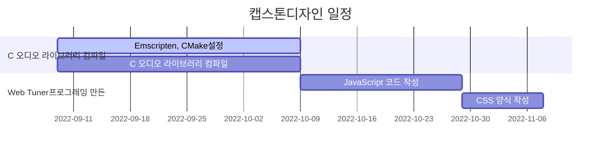
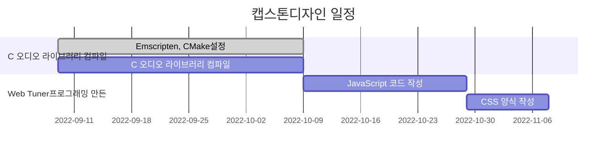

# aubiojs

| 프로젝트 주제 | WebAssembly 통해 Web Tuner프로그래밍 |
|:----:|:----:|
| 팀원 | 강영걸 |
| 작성일 | 2022.09.15 |

## install dependencies
```bash
$ npm install
```

## build .wasm file
```bash
$ npm build 
```

## start the dev server
```bash
$ npm run serve
```

## 프로젝트 배경

- 악기 연주를 할 때 항상 기준 조율을 해야 하는데 일반적으로 모두 네이티브 소프트웨어를 통해 이루어지는데 브라우저는 성능 문제로 인해 정확한 음고 검출을 할 수 없다

##  캡스톤디자인 목표

- WebAssembly 기반 브라우저 실시간 피치 감지

## 캡스톤디자인 관련 조사
- JavaScript는 동적 변수를 사용하는데 정적 변수 유형이 없기 때문에 JavaScript 실행 중에 변수 유형이 자주 바꿔서 엔진 최적화가 작동하지 않다. 이것은 JavaScript 실행 효율을 떨어뜨리는 주요 원인이다.
[](https://imgse.com/i/vx50bR)
- JavaScript 엔진이 asm.js를 실행한다는 것을 알게 되면 최적화된 코드임을 알 수 있으며 구문 분석 단계를 건너뛰고 어셈블리어로 바로 전환할 수 있다.또한 브라우저는 WebGL을 호출하여 GPU를 통해 asm.js를 실행한다. 즉, asm.js의 실행 엔진은 일반적인 JavaScript와 다르다.asm.js는 브라우저에서 네이티브 코드의 약 50%를 실행한다고 한다.
- WebAssembly는 최신 웹 브라우저에서 실행할 수 있는 새로운 유형의 코드입니다. 네이티브에 가까운 성능으로 동작하며 컴팩트한 바이너리 포맷을 제공하는 저수준 어셈블리 언어로, C/C++, Rust 등과 같은 언어의 컴파일 타겟으로써 그런 언어로 작성된 프로그램을 웹에서 사용할 수 있게 해준다. 또한 JavaScript와 함께 실행되며 서로를 보완할 수 있도록 설계되다.

## 캡스톤디자인 과정
- Emscripten 같은 도구를 사용해서 C언어로 작성된 오디오 라이브러리 aubio를 .wasm으로 컴파일하다.
- 생성된 aubio.wasm를 통해서 Web Tuner프로그래밍 만든다.

## 캡스톤디자인 일정



### 9.12 ~ 9.30 Emscripten 사용해서 C언어로 작성된 오디오 라이브러리 aubio를 .wasm으로 컴파일하다.
- aubio를 컴파일하기 위해서 [emscripten](https://emscripten.org/)를 설치해야 합니다.Emscripten은 WebAssembly 도구 체인의 중요한 구성 요소입니다.간단한 이해로 Emscripten은 C/C++ 코드를 ASM.js와 WebAssembly 코드로 컴파일하는 데 도움을 주며 필요한 자바스크립트 풀 코드를 생성하는 데 도움을 줍니다.
[](https://imgse.com/i/xmNYU1)
emscript 다중 파일 컴파일 떄 [CMake](https://cmake.org/) 필요합니다. CMake를 통해 여러 개의 c 파일을 동일한 대상 파일로 컴파일합니다. 음고검출과 박자검출만 필요하기 때문에 오디오 라이브러리 안에의 필요한 부분만 선택해서 컴파일하면 됩니다. javascript는 유형이 없는 언어이기 때문에 컴파일하기 전에 출력 함수의 데이터 형식을 지정해야 합니다.

- 박자검출결과
  [](https://imgse.com/i/xmBzqO)
  [](https://imgse.com/i/xmDolt)
  오디오 라이브러리의 박자검출함수를 사용하여 얻은 결과에는 일정한 오차가 있으며 테스트를 거친 오차는 1% 미만입니다
  - [tempo](https://tourscholar.github.io/aubiojs/tempo.html)
  - [120BPM](https://www.youtube.com/watch?v=JwbMnagnFsc)
  
- 음고검출
  이 부분은 음고검출함수가 정상적으로 동작할 수 있는지를 확인하려고 합니다. 다음 단계는 음고검출함수를 위주로 프로그램을 개발할 계획입니다
  - [pitch](https://tourscholar.github.io/aubiojs/pitch.html)

지금까지 성공적으로 오디오 라이브러리를 컴파일했습니다.그리고 음고검출함수와 박자검출함수의 실행가능성을 확인했습니다


### 10.01 ~ 10.07 음고검출함수